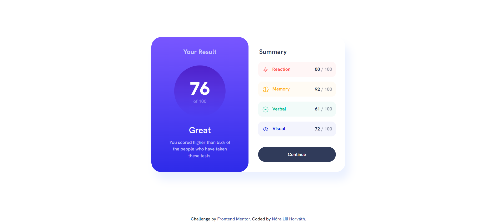

  
 
# Results summary component project  

## About 

This is my first code challenge on Frontend Mentor. For this project, I was using  
- **HTML5** markup,
-  **CSS** custom properties,
- Flexbox, grid,
- **Bootstrap** to create a visually appealing webpage.
 
While it's currently a static design, I'm thinking about incorporating JavaScript in the future to make it more dynamic and interactive.

## What I learned

Throughout this project, I acquired a comprehensive understanding of responsive design principles and implemented grid systems. Additionally, I honed my skills in effective time management, ensuring the timely completion of tasks and milestones.

## Links

- [Live Site]()
- [Solution]()  
- LinkedIn - [Nóra Lili Horváth](https://www.linkedin.com/in/nora-lili-horvath/)
- Frontend Mentor - [@NoraLili](https://www.frontendmentor.io/profile/NoraLili)  
